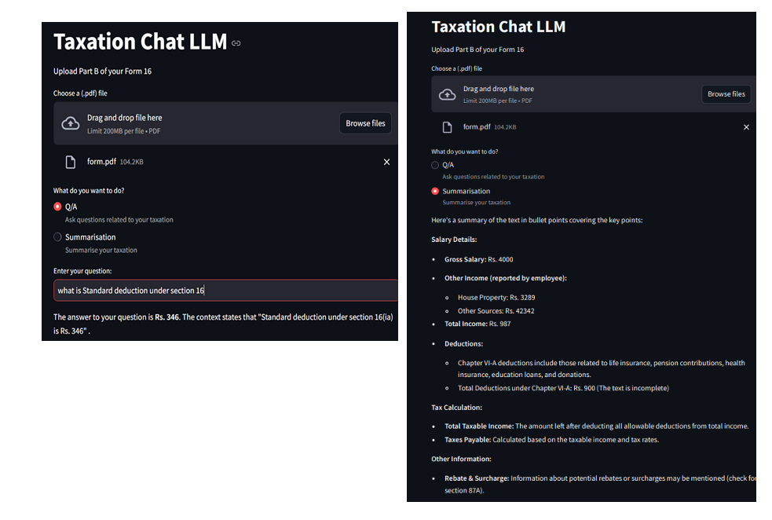

# RAG TAXATION SYSTEM 

Tax filing can be a complex and daunting task for employees. To simplify this process, 
this project aimed to create an AI-driven system that analyzes employee Form 16 
documents and provides personalized tax recommendations. 

**Pursued this as a minor project while working as a Data Science Intern at PNB.** 
## Objectives:

- To automate the summarization of Form 16 for each employee. 
- To extract notable tax deductions and financial information. 
- To provide tailored recommendations for future tax return filings.

## Methodology:  

The project employed Generative AI, LLMs, and Langchain to process and analyze 
the tax documents. The approach involved:

1. **Data Extraction:** Collected Form 16 documents from employees, ensuring all 
necessary information was captured. 
2. **Document Summarization:** Used generative models to summarize the contents 
of Form 16, focusing on key financial data such as salary, deductions, and 
taxable income. 
3. **Information Extraction:** Implemented algorithms to identify notable tax 
deductions and financial elements, such as investments, insurance premiums, 
and eligible rebates. 
4. **Recommendation Generation:** Based on the extracted data, the system 
provided personalized recommendations for optimizing tax returns in the 
upcoming financial year. 
5. **User Interface:** Designed a user-friendly interface where employees could 
easily access their summaries and recommendations, ensuring a seamless 
experience.

## Impact:  

The AI-driven tax recommendation system significantly reduced the time employees 
spent on tax-related inquiries and filing processes. By providing personalized insights 
and recommendations, it empowered employees to make informed financial decisions, 
ultimately leading to better tax compliance and optimization.

## Final Outcome

